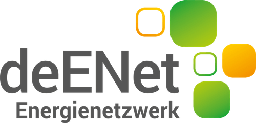

# klimo App - Readme

## Über das Projekt

Die klimo App ist ein zentraler Bestandteil des Projekts "LESS is more", das vom Bundesministerium für Wirtschaft und Klimaschutz gefördert wird. Ziel des Projekts ist es, das nachhaltige Denken und Handeln der Einwohner:innen in Kassel durch die Nutzung der klimo App zu fördern und regionale Klimaschutzprojekte einzubinden. Der Ansatz des Projekts ist so gestaltet, dass er auch auf andere Kommunen übertragbar ist.

**Projektzeitraum:** 01.01.2021 – 31.12.2023

## Beteiligte Organisationen

### Hauptentwickler
- **twigbit technologies GmbH**
  - **Kontakt:** post@twigbit.com
  - **Aufgaben:** Technische Konzeption und Entwicklung der App sowie der begleitenden Web-Plattform.
  - 

### Weitere Projektpartner

#### Fraunhofer IEE
- **Fokus:** Energiewirtschaft und Energiesystemtechnik
- **Aufgaben:** Berechnung und Bilanzierung der CO2-Daten, Konzeptentwicklung und Umsetzung der CO2-Uhr, Entwicklung von Aktionssträngen, Verstetigung der Projektergebnisse.
- 

#### Universität Kassel
- **Fachgebiete:** Mikroökonomik, empirische Energieökonomik, BMBF Nachwuchsgruppe DeCarbFriends
- **Aufgaben:** Gamification und Nudging, Gestaltung, Begleitung und Auswertung des Vorhabens unter energiewirtschaftlichen, sozial- und verhaltenswissenschaftlichen Gesichtspunkten.
- 

#### deENet e.V.
- **Schwerpunkt:** Dezentrale Energietechnologien, Energieeffizienz und Klimaschutz
- **Aufgaben:** Teilnehmendengewinnung, Entwicklung von Aktionssträngen.
- 

#### House of Energy e.V.
- **Positionierung:** Unterstützung der Energiewende konzeptionell und wissenschaftlich.
- **Aufgaben:** Projekt- und Prozesssteuerung, Teilnehmendengewinnung, Entwicklung von Aktionssträngen, Verstetigung.
- 

## Quellcode-Dokumentation

Diese Repository enthält den Source Code für die klimo App. Sie ist ist auf Basis des Frameworks "Flutter" entwickelt. Der Code ist organisiert in Modulen, die spezifische Funktionalitäten der App repräsentieren. Das Verzeichnis `packages/datamodels` enthält die Datenmodelle sowie die Logik für den CO2-Rechner. Für eine Funktionale Umsetzung muss ein Firebase-Projekt erstellt und mit dem Projekt verknüpft werden.

Bei Fragen wenden Sie sich gerne an post@twigbit.com.

### Lizenz

Dieses Projekt ist unter der "Attribution-NonCommercial-NoDerivatives 4.0 International" Lizenz veröffentlicht. Weitere Details zu den Nutzungsrechten finden Sie in der LICENSE-Datei in diesem Repository.
